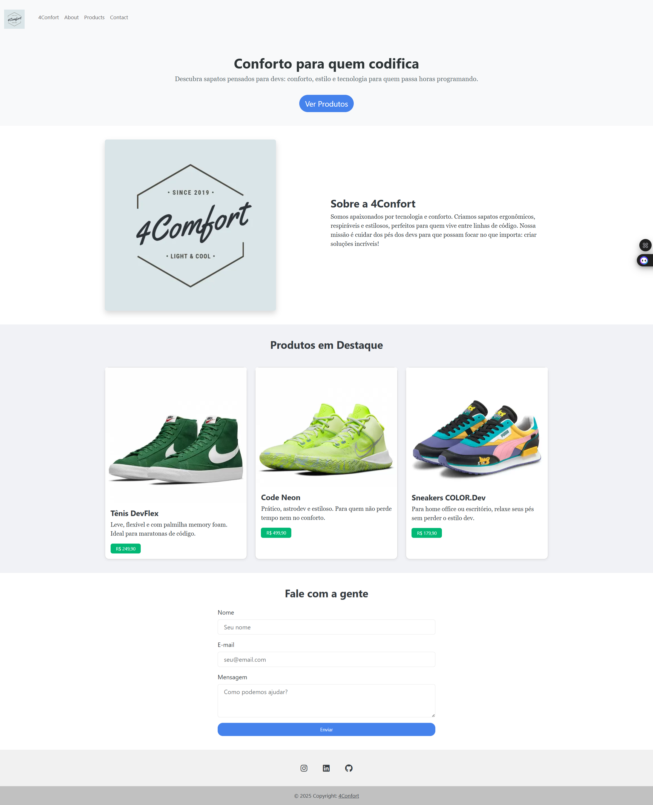

# Landing Page
Nesse projeto, nosso objetivo é criar uma **Landing Page**, ou seja, um site de **apenas uma página** cujo objetivo é atrair clientes e despertar curiosidade e interesse nos serviços e/ou produtos de uma empresa.
Durante a construção desse site, serão estudados e praticados os seguintes conteúdos:
* HTML
* CSS
	* Flex
	* Grid
* DOM 

# Enunciado
Você deverá desenvolver uma Landing Page para uma das empresas fictícias apresentada abaixo. 

#### Projeto 4Comfort

  4Comfort é uma nova empresa cuja proposta é oferecer o tênis mais confortável possível. Seguindo modelos americanos de sneakers o tênis é voltado para um público que trabalha em ambientes casuais (startups, empresas de tecnologia, escritórios modernos etc.) e se destaca por ser vendido exclusivamente online.

### DEPLOY E RESULTADO
Confira o <a href="https://projeto-landing-page-bice.vercel.app" target="_blank">DEPLOY</a> e imagem do resultado
